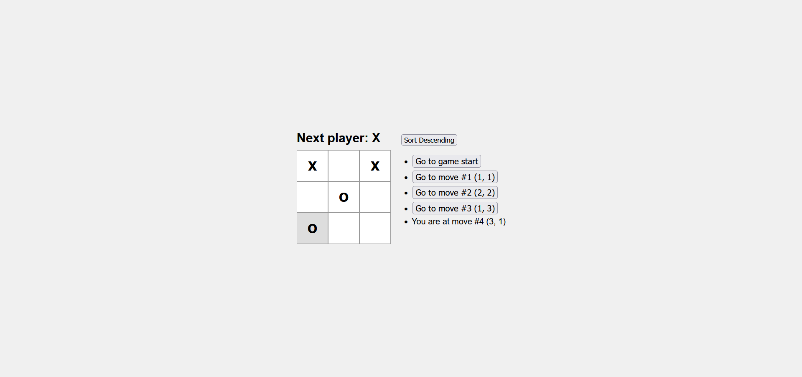

# Tic Tac Toe React

A simple and interactive Tic Tac Toe game built with React, following the official [React tutorial](https://react.dev/learn/tutorial-tic-tac-toe).

## Live Demo

Play the game online: [stijnris.github.io/TicTacToeReact](https://stijnris.github.io/TicTacToeReact/)



## Features

-   Classic 3x3 Tic Tac Toe gameplay
-   Move history with time travel
-   Sortable move list
-   Responsive and modern UI

## Getting Started

### Prerequisites

-   [Node.js](https://nodejs.org/) and npm installed

### Installation

1. Clone the repository:
    ```powershell
    git clone https://github.com/stijnris/TicTacToeReact.git
    cd TicTacToeReact
    ```
2. Install dependencies:
    ```powershell
    npm install
    ```

### Running Locally

Start the development server:

```powershell
npm start
```

Open [http://localhost:3000](http://localhost:3000) to view it in your browser.

### Deployment

To deploy the app to GitHub Pages:

```powershell
npm run deploy
```

## License

This project is open source and available under the [MIT License](LICENSE).
